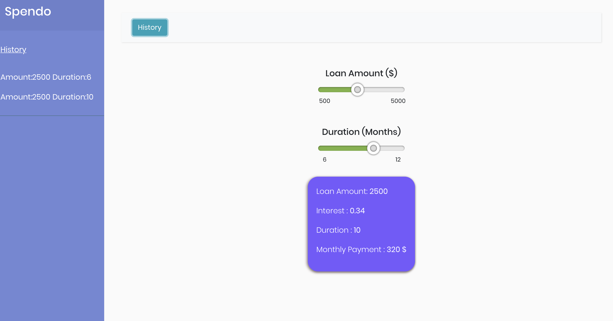

# Spendo

# Libraries Used

- Bootstrap
- React

# Store

- Redux

# Caching Mechanism

 For the purpose of caching, I have used the following approach. 

As and when the user changes the slider, it triggers an action to check if the amount and month combination exist in the localStorage. 

If the combination exists in the localStorage, we do not make a request to the server to fetch the details and get the details from the cache. To intercept every request I have created a custom middleware which intercepts the actions of the type CHANGE_LOAN and CHANGE_DURATION which include payloads with the respective values for the new loan and duration respectively. I then check if the combination is present in the localStorage which looks like this.

If the combination is not present in the cache, I make a call to the server to fetch the data. On completion of the request, the amount and duration combination is then added to localstorage as the key and the details as the value. 

# Screenshot

